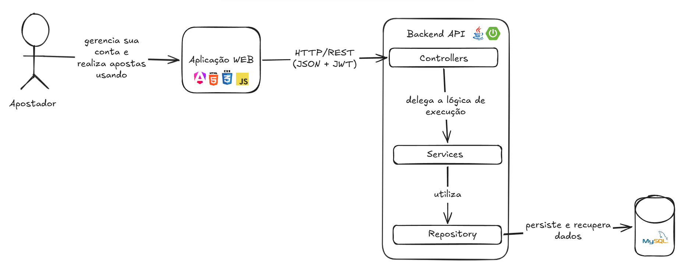
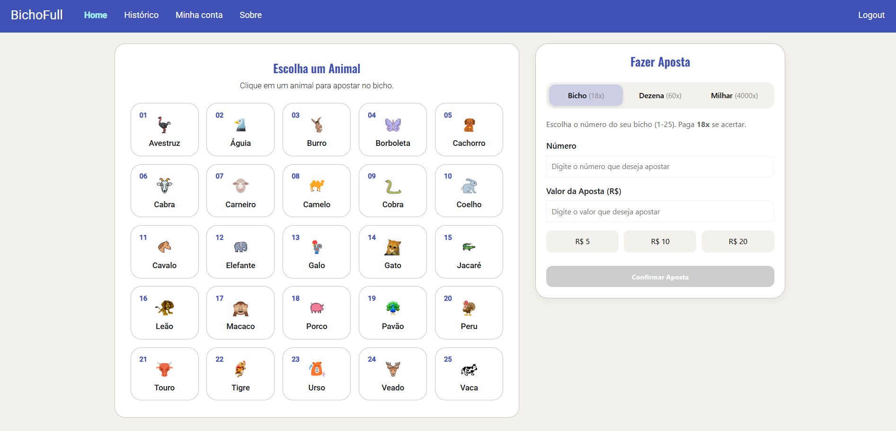
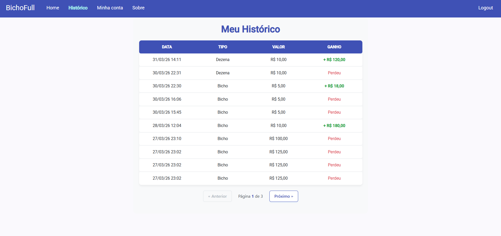
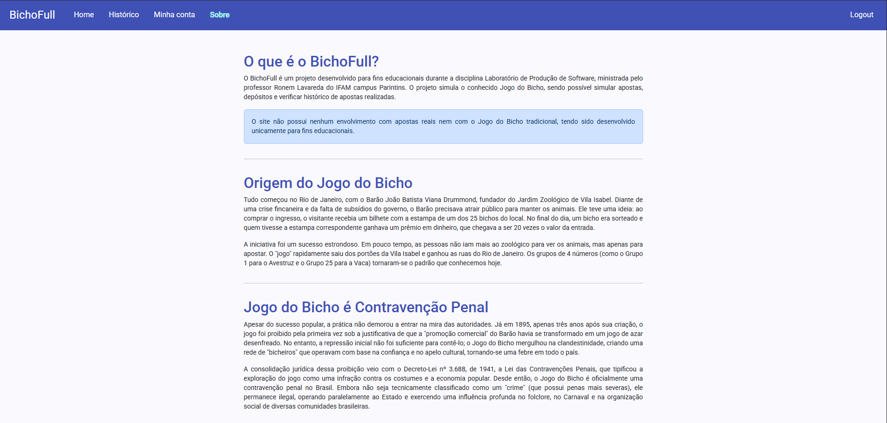

# 🐾 Jogo do Bicho – BichoFull

O **BichoFull** é uma aplicação web desenvolvida para simular o tradicional Jogo do Bicho, com fins exclusivamente educacionais.  

O projeto está sendo construído como atividade da disciplina **Laboratório de Produção de Software**, ministrada pelo professor Ronem Lavareda no **IFAM – Campus Parintins**.

> ⚠️ Este sistema tem caráter acadêmico e não possui qualquer vínculo com práticas reais de apostas.

---

## 🚧 Status do Projeto

🚀 **Em desenvolvimento**

Atualmente a aplicação está em fase de implementação e evolução contínua, com melhorias sendo adicionadas gradualmente tanto no front-end quanto no back-end.

---

## 🛠️ Tecnologias Utilizadas

### 🎨 Front-end
- Angular  
- Angular Material e Bootstrap

### ⚙️ Back-end
- Java  
- Spring Boot  

### 🗄️ Banco de Dados
- MySQL  

---

## 📌 Arquitetura

A aplicação segue uma **arquitetura monolítica**. 

Em relação ao back-end, o mesmo encontra-se utilizando **arquitetura em camadas**, separando responsabilidades em:

- Controller  
- Service  
- Repository  
- Model  

Isso garante maior organização, escalabilidade e facilidade de manutenção.

---

## 🔐 Funcionalidades do Back-end (API)

A API REST está sendo desenvolvida com os seguintes endpoints:

### 🔑 Autenticação
- `POST api/auth/register` → Cadastro de usuário  
- `POST api/auth/login` → Login de usuário  

### 👤 Usuário
- `GET api/users/me` → Dados do usuário autenticado  
- `PATCH api/users/me/change_password` → Alterar senha  
- `POST api/users/me/deposit` → Realizar depósito de saldo  

### 🐯 Animais
- `GET /animals` → Listar animais disponíveis  

### 🎲 Apostas
- `POST /bets` → Criar nova aposta 
- `GET api/bets/my-bets` → Listar apostas do usuário autenticado 
- `GET /bets/{id}/result` → Dados do resultado da aposta  

## 🖥️ Telas da Aplicação
### Tela Principal ###

### Tela de Histórico ###

### Tela "Sobre" ###

---

## Como executar
### Pré-requisitos
- Ter Docker instalado

### Passo 1:
- Clone o repositório do projeto:

Desenvolvido por **Matheus Nobre** 🐾  
IFAM – Campus Parintins