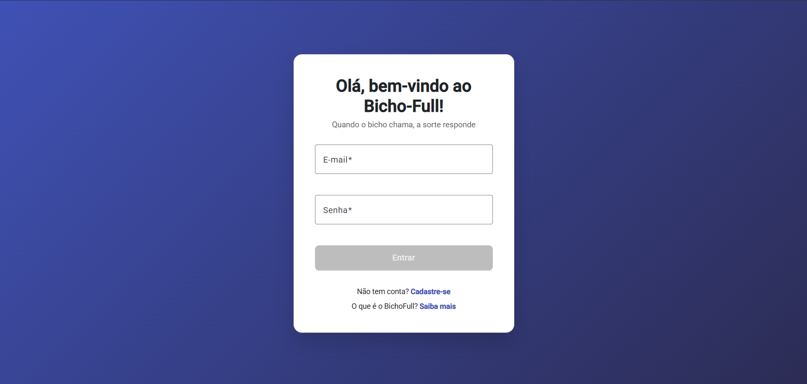
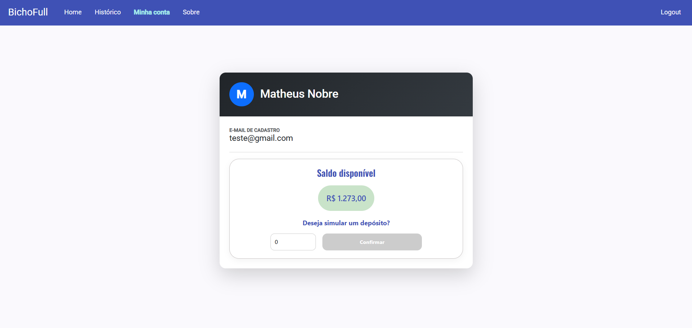

# 🐾 Jogo do Bicho – BichoFull

O **BichoFull** é uma aplicação web desenvolvida para simular o tradicional Jogo do Bicho, com fins exclusivamente educacionais.  

O projeto está sendo construído como atividade da disciplina **Laboratório de Produção de Software**, ministrada pelo professor Ronem Lavareda no **IFAM – Campus Parintins**.

> ⚠️ Este sistema tem caráter acadêmico e não possui qualquer vínculo com práticas reais de apostas.

---

## 🛠️ Tecnologias Utilizadas

### 🎨 Front-end
- Angular  
- Angular Material e Bootstrap

### ⚙️ Back-end
- Java  
- Spring Boot  

### 🗄️ Banco de Dados
- MySQL  

---

## 📌 Arquitetura

A aplicação segue uma **arquitetura monolítica**. 

Em relação ao back-end, o mesmo encontra-se utilizando **arquitetura em camadas**, separando responsabilidades em:

- Controller  
- Service  
- Repository  
- Model  

Isso garante maior organização, escalabilidade e facilidade de manutenção.


---

## 🔐 Funcionalidades do Back-end (API)

A API REST possui os seguintes endpoints:

### 🔑 Autenticação
- `POST api/auth/register` → Cadastro de usuário  
- `POST api/auth/login` → Login de usuário  
- `POST api/auth/logout` → Logout de usuário

### 👤 Usuário
- `GET api/users/me` → Dados do usuário autenticado  
- `POST api/users/me/deposit` → Realizar depósito de saldo  

### 🐯 Animais
- `GET api/animals` → Listar animais disponíveis  

### 🎲 Apostas
- `POST api/bets` → Criar nova aposta 
- `GET api/bets/my-bets` → Listar apostas do usuário autenticado 
 
---

## 🖥️ Telas da Aplicação
### Tela Login ###


### Tela Principal ###


### Tela de Histórico ###


### Tela "Minha Conta" ###



### Tela "Sobre" ###


---

## Como acessar o projeto de forma remota 
* [Site] (http://18.220.215.216/) 
* [BackendDocs] (http://18.220.215.216:8080/swagger-ui/index.html)

## Como executar localmente
### 📋 Pré-requisitos
Antes de começar, você precisará ter instalado em sua máquina:
* [Docker](https://www.docker.com/get-started) 🐳
* [Docker Desktop](https://www.docker.com/products/docker-desktop/) (Certifique-se de que ele esteja em execução)

### Passo 1: Clone o repositório

```git clone https://github.com/matheushnobre/jogo-do-bicho.git ```

### Passo 2: Acesse a pasta do projeto
- Abra o terminal na raiz do diretório clonado:

``` cd jogo-do-bicho ```

### Passo 3: Suba os containers
- Execute o comando abaixo para buildar e iniciar todos os serviços:

``` docker compose up -d ```

### Links de Acesso

Acesse o projeto por meio do endereço: 
```http://localhost:4200```

Desenvolvido por **Matheus Nobre** 🐾  
IFAM – Campus Parintins